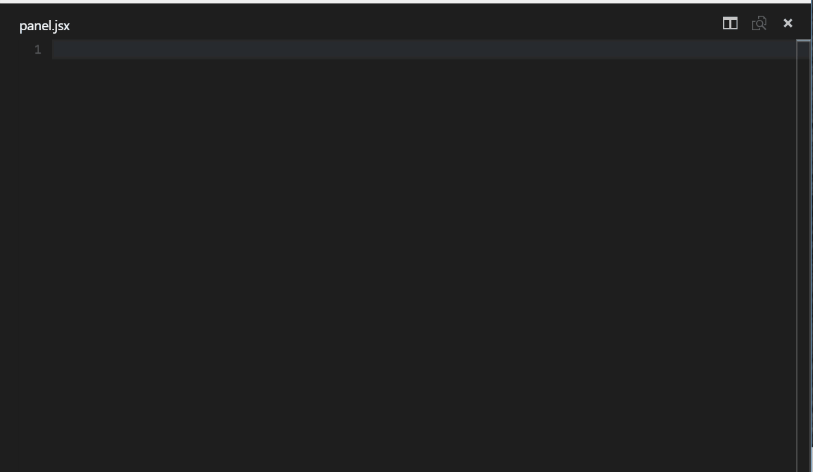

# Typescript-React-Vscode-snippets

---

This project is based on [vscode-react-typescript](https://github.com/infeng/vscode-react-typescript) and [Reactjs code snippets](https://marketplace.visualstudio.com/items?itemName=xabikos.ReactSnippets)

## Object

This project provide a set of snippets to Visual Code to assist developers of React/Typescrip to increase their productivity.

## What is a snippet in Visual Code?

here is an example

## How to use

In Visual Code window go to **Preferences** > **User Snippets** > **New global Snippet** and them in this project copy all the content of the file [snippets.json](https://raw.githubusercontent.com/matheusMFCosta/Typescript-React-Vscode-snippets/master/snippets.json) and past in visual code

With the first step complete, just type in any file a trigger string (all listed below) to include the snipet anywhere you want

## Snippets

Below is a list of all available snippets and the triggers of each one. click on the link to check out

->>>

| Trigger                                                                                                                                                                                                                                                                                                                                                                                                                                                                                                                                                                                                                                                                 | Content                                                                                             |
| ----------------------------------------------------------------------------------------------------------------------------------------------------------------------------------------------------------------------------------------------------------------------------------------------------------------------------------------------------------------------------------------------------------------------------------------------------------------------------------------------------------------------------------------------------------------------------------------------------------------------------------------------------------------------- | --------------------------------------------------------------------------------------------------- |
| [tsrcc](https://itty.bitty.site/#/?XQAAgACtAwAAAAAAAAAeGIPFKxAzt4kEEkbKZhVKk0lBojauxQ+fDXV3DUBdkFPTyT4SH5AlYs3E/TkcbKVfXBaM2iSQz0azAhx/gsy3rySjHPH0SDy8eO6VMZL0yCiGNtn6/SJfxiYD62FmVamKIvY7LPsRTR1IDE/V1kczLAmPBnya16wtKumuG2HBFVWNKJwMh57qwHVDAaC2Qk9/41Hk6kMd6narAL52pXNztVmz8zV+UZckWFQ7z6XS2PVNsdOXlAaoaF49hYBiK0B9MI52PDAkDHWrrY4m4QkCYqhVSYZwUnVAtiX6w6n+gpbBHAlx7F89WzItYhDdKluQ0i+VtbaZqIO6sNAHCigT2ZX6oiXOcvU+mcqQZY+rRJNM9J9CIA1TrDqpxR50YfmLHFN9EY2vDSgMDerJoJQsvFsFbhMSI4YffJNxWfNgdVV3DyYzv7TpjXAQu8R3sfNJIwhpGsxVdkLQO7fN5C8//3cFqgA=)                                                                                                                    | Create a React Component with typescript.                                                           |
| [tsrcfull](https://itty.bitty.site/#/?XQAAgABzBQAAAAAAAAAeGIPFKxAzt4kEEkbKZhVKk0lJLkvYMO0U+b/prYQwxsZ2aV82iY68uc9hroRWl95clrDomjOKsH2s6KZj+6bNfwsRZa+nFYWUKaMs+0h0l7qhGd0QNhjZX76kdcoK6Bz9udpah91zPOho5jbCMNo+4nYCbuXs2p/lUG/QjTHY2M0MgNyW6+85eFOh4GIKyuMGSnnJajluak004kRal3nqTdwskI2+msG+TNnZfCjbmwRdCz2qbnbTQDKlEr79NgB3qL+yHmDML2D4GQztvYQ4gFOxPV+B9/mtRSklK0G1GoaV65Y1T09UZToZr9iftAqM6O2u9anmYdOjUN5Q+uq2DGlyaA/nI10bupJ3JGG3cSy6Q57tQSzEnS0VRaOI+8HqykZiB+3qKE7N3ZasMx9X/3UV6xut1C3ZjJ2Kk5uZGEEeGOkWYyxiiL+ciK0p2Gdh7Rhy8rwkQR8C/Z232XUszeoDnY8coUKgo4e+ECobL55u71nuFJ/h1Yzawg9YttrHdpWj7JzVrllqtlCr4Uomuk6+yJ9+XneuQPU+YH4Tt7ot5utR63RaIR3ssylvbMBzM/7/1EqUYw==) | Create a stateful React Component with typescript with Props, State, and a constructor.             |
| [tsrpcc](https://itty.bitty.site/#/?XQAAgACqAwAAAAAAAAAeGIPFKxAzt4kEGKvD5AwI2RjzzYZV1TOnyeN/7CpmIn7kCUqumvxpzoZvOdEHfBe6AdWMNq0vJ6W21DZH3iQAUvOer3JKDVrx/3ShrKVKM2N0saK8ngxeP6uQeUmgk7NfPBWBGu2xo5k+GxGdUAW8aINzF7sfq+g7cGxKn0pwn/GDJt6kvqQijSsSC92U6oqxREE/f4YBLVqccwzQtpHtDDaoNAajOHvhWOlX/LAp77/Pc2y3r3Lff0lDM6aDXQCdgzK2TVJmvKUReK8/iB0pWcANNccDAfE6WBn+eZZBAM1ObOQWTFj+LfMwYvbn77EQzcxTdqNLjAQnKhRUHb5eBq97p1wJSmBeW42azO7JKiNtccrsKuqJYt2CgZJClW/oAZ1dgTdIe5IG0VzzkU+1bnlmm2VeYXkyTpBJw4NHIwF2nfDnRd62hv8r3VfnFGPqEyQlSR0h/++Nkdc=)                                                                                                                               | Create a React PureComponent.                                                                       |
| [tsrsfc](https://itty.bitty.site/#/?XQAAgABMAgAAAAAAAAAeGIPFKxAzt4kEGlcTp/Vhb7w2glCel1Pj+LE1/tFOgWKslkMJMpYLZcjWfAuEt5BI8TQUj7JlorSoO+XImFOKZ1QBWwQeddlQ1SHN3MS2LUwoq0YOf5UVnP30Rx4t2eew9U7gFhHqKZ0omEWnZ8scrkZ+7VgDQ5m6bHRh2s6ihzcugLmEkUVR1/ayZ6R7xqIC0cpESDtDCC9QlBZI500V6g+xWaa21KyEbmyVnHjN0spVd7jldztjPIT+mEZ+6T6uSRoDmc8lBzOXpD3GDgTGdPw8HsIPCinoRF6lpKwmX/RLW3FbaLBRe7PNclup3aXpK0TCR7NxHniZ7fUUG1E+TnjUbdGwt7MIVCBEYKSQxKMW2WJtB0CopXBUhbXHaTkYTMDYlZC+PojY8XmWSvs2ItJnn6SEagykmp//a28HAA==)                                                                                                                                                                   | Create a React Stateless Functional Component.                                                      |
| [conc](https://itty.bitty.site/#/?XQAAgABUAQAAAAAAAAAeGIPGTLE9rWudGotQLIXTKa7SLGzFpd8NNH+YQsm9IXGV7W10DKWYXxlrUR5M8f3i6lZOVdOkt6kgYkuwPp0laT+tERAPZXg1kY+4d4OpMHZz3eUZhFzIJVyEZWfxX/KXyo4UVxnMzlMREw24wxHoc3U1vV3rlei1MKIrCuI3zDHEYaZoxJSkoNXFvQt8lB806v2zlNVPaw1gL8ywHReNXYZdfzNq1L9KzDPzaAcw6ZNI5Phnx3E3eP1F2K3U/UUtM8Zr/TF8Zg==)                                                                                                                                                                                                                                                                                                                                     | Add a constructor in class.                                                                         |
| [cdm](https://itty.bitty.site/#/?XQAAgABRAQAAAAAAAAAeGIPGTLE3pVeV9hURw5o9jqmEH8VsMkAkm5PM6DzU73eRk6+55RiV1hohL02KiXc7lZoawiLtUw+ctvQnoIU2XBTeo36rXTCgUi5yuOGqRVAr27Fxgrs5irleO6pWV/zrPuh2VG3jAcGB4oUFCS/Y8Nx6UMfWW4M0DVH/LZk8/hyDEqMC4+lENEPwuH7d6yGvhqafZoyjcIMjpg7AIj2StmGu2tlQdmp52eXfItdc9sySQWcy3+1wYDK8DLOBVXwL1GiIEFmW2LEZW/rcXShf/F9O/w==)                                                                                                                                                                                                                                                                                                                      | Invoked immediately after a component is mounted.                                                   |
| [scu](https://itty.bitty.site/#/?XQAAgAC0AQAAAAAAAAAeGIPHZrVYlBJUel1CVPBXpSu65V+SxDuobtE+dVMEeskCAP4swQ6RrMqVPdnR948lGraxaTvZ8oBG0ZWZcOujbhyNZPuWUrVk2XR8JTFT+qlpojT7UDPQfHt4NoOg3gpssm6NZbBtepTCKnwy53AQaCchzaMw3Sg4ZlhbMZprGGYnqeoAOAzQa0dVeAVOGrUaf3K16fiKxorklsuhjamm+2tq3WllZ9nS17RTeTxUh+t/9RseCqDrQaSEuorJWFnmrDSdegglw0yB6zxIupVh3JJcK9GyQuy832MNhfe1hlNugYbSBbgS0LiwD5312YvaoHgeH+dEc8hPZZd8c6V//iiysA==)                                                                                                                                                                                                                                                      | Invoked before rendering when new props or state are being received.                                |
| [cwu](https://itty.bitty.site/#/?XQAAgAC8AQAAAAAAAAAeGIPGTLE3pVeV9hUR2OS07B1A8PawUxKlCvVPLzVr73OA+qZhK4gF4OXP0U2Znqbr/tVgAxNNZhrx8HDLEb0SLHYg6ku/oK0++irovW6klxmV4TDUDPMZC/Z8qf2q0+h7h8JnYvPjHvXRtCU17jIwXAhjrA50VAlQyo3MihpEI/FJSO9fnmaVDPaI9j1sOd8B9Yw0xGUlhTcXbH/72pDpvfElR1axEZFp9zprfDutzudKwE8fvXyrLv7bGLwDiJc3iDIEC0Nqty8uWDG5fcmtIdReeMfa+HLvruK30iODX1J2AH7R5hnntC2VYhV0RZBOcnnDZc4RWhNGur87ntyw4y2t9AKhkHv7BDoP)                                                                                                                                                                                                                                              | Invoked immediately before rendering when new props or state are being received.                    |
| [cdu](https://itty.bitty.site/#/?XQAAgADFAQAAAAAAAAAeGIPGTLE3pVeV9hURw5o9kgnAZd/5hKmqphmuQ8aBlkwgMSziLxj7icE2cMWeeZoOhYoTbF+oHfd++4PGcXNmivox7Vx5ptkfuRUJPlfsYkAoCKSEp3Y/lfEFOM/BaaWdpRPLGYMPgBw3Wn/ANqEJhsEu18YYMeyHYT4aVEmZDPcdh2+BfvMCpWkwJAWYH8sIiFBmBzuptRxOKKfkPcBzwyrrHDyAHI+9aCoqmPrh5dGPv1Pmda4q81h7UPJkmxEZjWyKnqpxGoEH5+CPToOV8I0xMbAQCilnVrmpyAp3h4I6O9+ToCf49/LNs0Z41UIaOOh7PMuPu38m5SBqZnTFdRJ3+jbKMdIgBNwciMU2KCdb+8bYEg==)                                                                                                                                                                                                                              | Invoked immediately after updating occurs. This method is not called for the initial render         |
| [cwum](https://itty.bitty.site/#/?XQAAgABoAQAAAAAAAAAeGIPGTLE3pVeV9hUR2OS07B06bfiAgP6KW1NdxUdLvk2BTWC/CbxyUKQawzsAvQ/5Xq/AbfpoDoIyrc+wb/R+qc0QFLEUDm7I5KjRIwtUe048eobgVi2zi2R9+9nzOlFA6BeUjKlKNN2rmimTZ8Cym3NVgKUFJ5I6xGbJOfaGy+BnIVvFAKKmxCqg8yadMfyu+r4uKusJF05QzodEuOpx9bqUIlpPsoclWOck9ACWE9he1xwGQ4a7ErzhDXBcteSf/yFvLU45Z5x3GtYFyikliOjt0+Klp8s7ungtT/5ibMo=)                                                                                                                                                                                                                                                                                                     | Invoked immediately before a component is unmounted and destroyed                                   |
| [sst](https://itty.bitty.site/#/?XQAAgABGAQAAAAAAAAAeGIPGTLE3pVeV9hUR1Gb16r+TZ5Fn8aJ2tbumrCp8zbBGC4DPVaVoLCavFQJLtKVl5HIcMop707pgKbaOf92sjYJnD8/OMV3RQ9/GOdafHSiHDtaHYFHwpu45pQg1Dbn9V4Az2lBjyGqR5qhnYsPt9iQ2Zieyx41NSvV81aBX340OQgPqt8K5YJbY6fram1Mc5X8WqWGNuqdxt5Ts1yRHmamHUcJjEIPkxwjM4LW8oBhjb9L4PeDeNmVpmbIhTcBbkLyO7bRMuZUk+CfI98H16mAuHCC+oASgln2a/+63GPk=)                                                                                                                                                                                                                                                                                                      | Performs a shallow merge of nextState into current state                                            |
| [met](https://itty.bitty.site/#/?XQAAgACGAQAAAAAAAAAeGIPG/yGeEbxD5yKs0wNxtGBU36ab38oLjTlVUP3AWkSYu3B2R4R4521NHdgLGr2AEiQHYwC54lFrZwHHVDjrA968GasBwMEClEv0lhd48OslpO+Rq/P+SolZ2g/tWMIdSV5St/aIKcsBYDlZ7lUB8HQ9hvXG4j4qyJyM/jCS5mlY2WTEyztQgh8tq7PDySCNI74iQvtVtjIxvZLJpoqtE+xfOWUilP18Y79AcdK7oCSaz8+nWyxkkoi3uMpD6voVEU/mulFG5qKNqzKzXf/vH+Ez)                                                                                                                                                                                                                                                                                                                          | Create a method                                                                                     |
| [tscntr](https://itty.bitty.site/#/?XQAAgAC1BAAAAAAAAAAeGIPFKxAzt4kEKlJZB0VpGWhsptGw7i/1wy+n5QOlb6S4AS26/eHuFiA2Ud5Lx+zYW1eYip7NmDC6chND6fU69FkUkaa0UBn0w4HOSCUl0N/7HEl7vp93TaS9YrtfxXf+zm1CFzF1yt5l9zy2WVCKwNsOdUOx/vTwmzUDAsesBdooqSjisIALI27pHcfY+jEiQYnq7VzBwVAsuygriV01RY/8/GreHRvRRNEI/h5lXFsXEhM8ZY4mKtDRdXqT/EgK7oTT3bUxlsvZTnjFO8wJmi1Tmeu2jpHHNwqiQp5uJOadZcKqA5TmrBij4j9hIdpf2JBxCUV6miGhoWobz3zvBE8erItEq4vLTQzacjw37K664vJ5pNRj5GzfKUtJwerqW99wpWI6qqKAPHONgi+febIRMalT4PsikNZ/AK944C9u16KdxqljANRYOeXS1V3lQRidF1ECshv9OuWE882hYQUzqIQ4s3DsfnHEIOGzs7t8WOhlltZtzNQWY1ZCfoDDlFwb1mOGmB7tcpfQRbO4YWcb9uuiWtP/qjBNWA==)                                       | React Redux container                                                                               |
| [imt](https://itty.bitty.site/#/?XQAAgAD6AAAAAAAAAAAeGIPGuUnIYH1We7vtMgNPx9r741VI1vM+jkVoFcKhm9s8zRkhPlYx+XB5UT1+g8kIHw9zSsB+r/sVstgB1I8ms6jLswzjFmnAL3pCasmCAfJ6dYlpIShQ6lLfr8TCzmDem1EtbpC+IbUh4U8TkDUfGZMJgqQqq8nGaYQG2kR962U0MM7JGGN6bZL/nkONB9R05O5yKjxNE/Q5YA8l0Obq2Jn62icG)                                                                                                                                                                                                                                                                                                                                                                                      | Create a import                                                                                     |
| [gdsfp](https://itty.bitty.site/#/?XQAAgAAbAgAAAAAAAAAeGIPGlYOzz42c6ENHyWCg8TPExz5IpZSLBaIQs5IWAzvZk1+Vfv+4l1jODXE10S/eMPvwzWV4nqs93gyLL24RYSesKNTxX2sbUFj3EGrKlkKTRXF7QdK5HXE6R9YfBoBJvyMu3QdMSS7rTmIfbKcA2DCUh1GY1YUkl3qln7ZONotqERMK5M672qoL0X69tFLvRoLOCRd6woBMuioRK7dHCRLSOA5zuVia5MAoV9Tzuv/5fdw9G+urR27z8cJces6Xqa0AEXfUcyoOLEmhq1GEfNQdw6zAEltaXGtePhtDGM2wJQNFEktB9jlKxLoDBLFLP6GQinQYyf2uASnLQLd0COH+fBcqkVxWePhL6fXKqFgx7/olqtXsZY2zChrXT3ATfnLMW9rTtu44p/X/vKuvAA==)                                                                                                                                                                                        | Invoked right before calling the render method, both on the initial mount and on subsequent updates |
| [gsbu](https://itty.bitty.site/#/?XQAAgAD8AQAAAAAAAAAeGIPGlYOz+TdI2BTrcz6xF0GZVF6sW9n+82chBW6zbbrB/zbwbsJAwWhUiMqkdTcf7WXx0t8q1noU1uHSKdJdYbXKLynZNUJyJWs1IR6OvHrF8O+CC/NmDgkJO+0D/81SVRndiM3fA24MDZXnICG/hufk3kpiofweSsgfTxil579y/hekZxObja/pZB8MdhBa6C6wxb47+epViSoHGRGFSY2xr50XZVd40fqGaDiCtNGqTc5aEZJ9Wa4HDxZuJG/jf5y9D69rNPx87BXZbmfWxF6ZilgNxqhvFn94RRzrNQ4s0zlKDCqBtZR9QPLOxvWhT0pvdAEy+7gsT7/N669vfTWCVF87bsq8vMyXx95E9mfWMwfb0Kukk1TgXvzD+Pg=)                                                                                                                                                                                                                 | Invoked right before the most recently rendered output is committed to e.g. the DOM                 |
